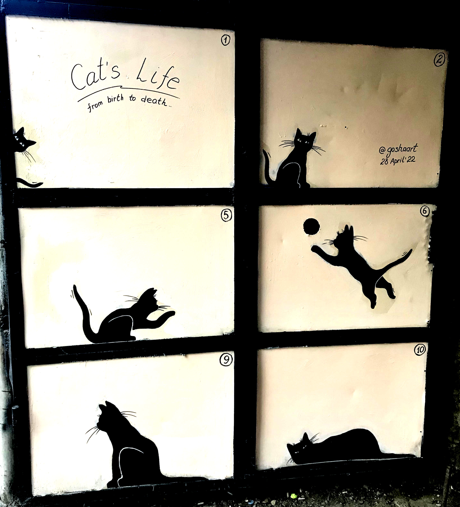

# Инструкция для работы с Markdown

## Заголовки

# Заг 1
## Заг 2
### 3аг 3
#### Заг 4

и так далее.

Альретнативный способ:

Заг 1
======

Заг 2
-------

__Но!__ В этом случае получаются заголовки только двух уровней. 

## Выделение текста

Italic — текст обрамляют звездочками (*) или знаком нижнего подчеркивания. Напр.: *милота*, _милота_.

Bold — текст обрамляют двойными звёздочками (**) или двойным знаком нижнего подчеркивания. Напр.: **милота** или вот так __милота__.

Альтернативные способы выделения текста жирным или курсивом нужны, чтобы совмещать оба способа. _Напр.:_ _текст модет быть курсивным и одновременно **полужирным**_.

Зачеркнутый текст получим, если обрамим слово двойным знаком тильды (~~). *Напр.:* ~~буду спать~~.

## Списки

Чтобы добавить ненумерованные списки, пункты выделяют звёздочкой (*). *Напр.:*
* Элемент 1
* Элемент 2
* Элемент 3

Или (-):

- Item 1
- Item 2
- Item 3

Чтобы добавить нкмерованные списки, пункты просто нумеруют. *Напр.:*

1. Пункт 1
2. Пункт 2

## Оповещения

> [!Внимание]
> Важная информация, которая заметна даже при беглом просмотре.

> [!Совет]
> Дополнительные сведения, которые помогают лучше решить задачу.

> [!Предупреждение]
> Опвсные действия.

## Работа с изображениями

Чтобы вставить изображение, напиши следующее:

Граффити в Тбилиси

Убить полотенце 

Бенгалы бесюкаются так 

## Ссылки

Фраза для ссылки должна быть понятной. *Напр.:* [Печать 3-D миниатюр для настолок](https://vk.com/tesseract_prints).

Сделать ссылку закладки на заголовок в текущем файле надо так:
[Цитаты](#цитаты).

Ссылки-сноски в тексте делают вот так:
Мне нравится история про [Двойной эффект нордической ходьбы][1], отзыв о гимнастике [Сеамм-Хасани][2] и новость о [новом гранте][3].

Чтобы эти ссылки-сноски работали, в конце статьи делают так (см файл .md).
<!--Reference links in article-->
[1]: https://podarizdorovie.ru/2020/12/14/двойной-эффект-нордической-ходьбы/
[2]: https://podarizdorovie.ru/2020/05/29/гимнастика-сеамм-хасани-научила/
[3]: https://podarizdorovie.ru/2022/06/15/как-помочь-пенсионерам-бесплатно-сох/

Посмотреть оформление ссылок на переход от одной статьи к другой и всё прочее можно тут: [Ссылка на сторонний сайт](https://docs.microsoft.com/ru-ru/contribute/how-to-write-links).

## Таблицы

Можно добавить до 4 столбцов и использовать необязательный атрибут span для объединения 2 или более столбцов.

| Заг 1 | Заг 2 | Заг 3 |  
|-----------|:-----------:|-----------:|  
| Ячейка A1 | Ячейка A2 | Ячейка A3 |  
| Ячейка B1 | Ячейка B2 | Ячейка B3 |

_Напр.:_

| Тезис | Фото | 
|-----------|:-----------:|  
| Красивое |  |

Можно и так:

|Язык | Метка|
|-----|------|
| Java Script | javascript |
| C++ |cpp|
|Markdown|md|
|JSON|json|
|Python|python|
|SQL|sql|

## Цитаты
_**Просто цитата**_

> Это цитата, состоящая из двух абзацев текста. Вы видите, что первый
абзац состоит из нескольких строк, но только первой из них предшествует
символ закрывающей угловой скобки.

> Это второй абзац текста.

_**Вложенная цитата**_

> Это первый уровень цитирования.
>
> > Это вложенная цитата.
>
> Возвращаемся на первый уровень цитирования.

_**Цитата с заголовком и со списком**_
> ## Таблицы в Маркдаун — ад кромешный
>
> 1. В ячейках нельзя написать текст длиннее пары слов, а тем более список.
> 2. Если диалект и позволяет пункт 1, это неудобно форматировать.
> 3. Если ячейки не выровнены, таблицу невозможно читать.
> 4. Нет поддержки однотипных таблиц и автоматики, вроде нумерации строк.

>> *Источник: [Хабр](https://habr.com/ru/post/474826/?ysclid=l610i855g898396003)*

## Оформление абзацев

__Отступы__

Чтобы добавить пронстранство между абзацами, надо  

Добавить 2 пробела перед концом строки и нажать ВВОД (пробел, пробел, ENTER).

__Горизонтальное правило__

Чтобы добавить горизонтальное правило, добавляем строку из ряда дефисов ---. Строка над строкой, содержащей ее, должна быть пустой. _Напр.:_

выше

------
ниже

Просто линия — 3 символа (*) или (-) на отдельной строке.

***

После горизонтальной линии надо добавить пустую строку

---

## Вывод
Прикольно и очень полезно `:)`